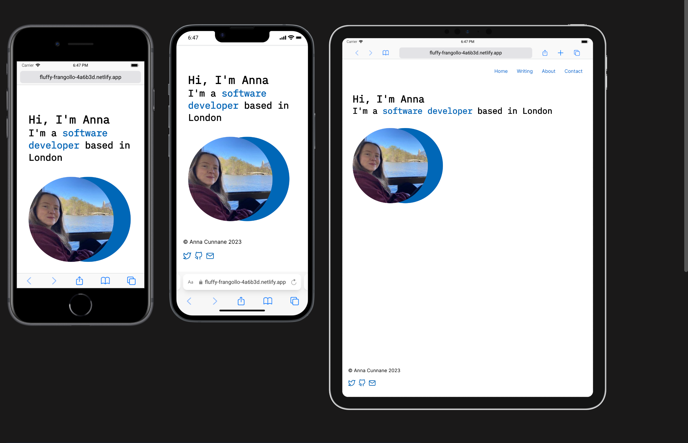
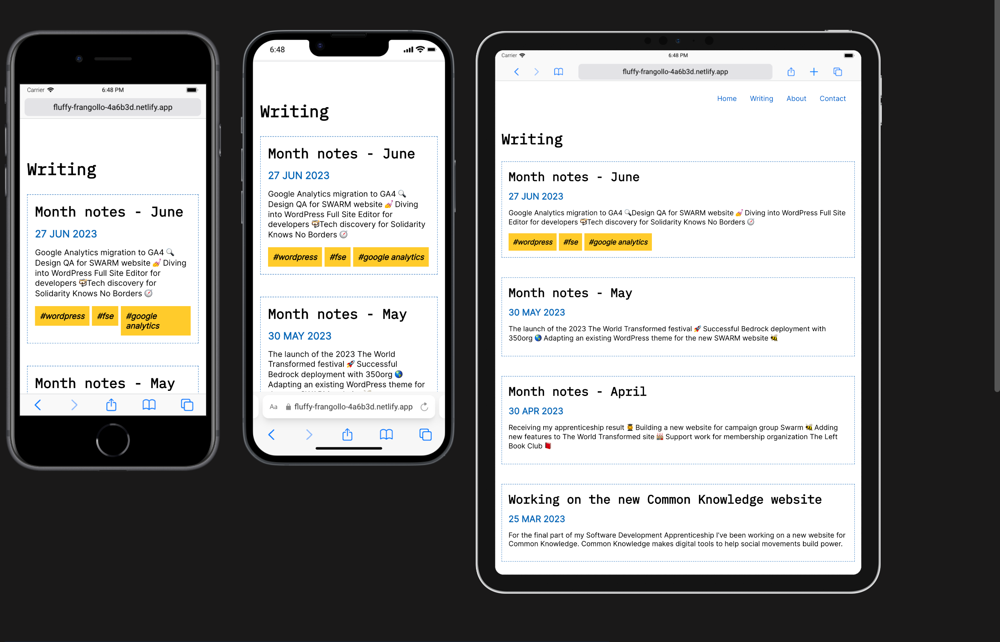

Over the last couple of months I’ve been rebuilding my personal website with Eleventy. This post is an update on that work. 

### Why move from the original site?
There are a few reasons why I wanted to make a new website:
1. I wrote the original site with Gatsby but Eleventy is a more lightweight static site generator with faster builds and performance
2. I knew that I wanted to use another SSG because I’m not using a CMS (my current blog content is in Markdown) and I could continue to host with Netlify.
3. My current site was written over three years ago and I’ve learnt a lot since then. I wanted a site that reflects my current ability.
4. I was interested in learning how to use Eleventy and it gave me the opportunity to learn the templating language Nunjucks.

### What is the MVP of the new site?
I set the target of getting an MVP (minimum viable project) completed by the end of this year.
The MVP includes the following:
1. A portfolio section to showcase my work
2. A dedicated space for my blog posts
3. A beautiful looking landing page that contains my portfolio; an about me section and a contact form using [Eleventy Edge Forms](https://demo-eleventy-edge.netlify.app/forms/)
4. Tags to organise my blog content (using Eleventy collections)
5. Frontmatter on my blog posts with summary, post date and tags
6. Google Analytics set up and meta tags generated by [eleventy-plugin-seo](https://www.npmjs.com/package/eleventy-plugin-seo)
7. An RSS feed for the blog created by [eleventy-plugin-rss](https://www.npmjs.com/package/@11ty/eleventy-plugin-rss)
8. A ‘good’ Lighthouse score and accessibility checks using the [WAVE](https://wave.webaim.org/) tool 

### Site Design 
There’s a lot of work still to do on the design of the site. I am looking for inspiration at sites like [Dribble](https://dribbble.com/) and [Behance](https://www.behance.net/). I am using IBM Plex Mono as my heading font and Inter for body text to create a modern and minimalist look with an emphasis on readability. At the moment I’m using a blue and orange colour palette but even if these change I would like plenty of white space with one or two accent colours. I would also like to add some scroll animations on the landing page. As I’m not as confident with design as I am with development I will probably get a designer friend to look over the site and give their feedback

The work in progress home and blog index page:

 

 

### Developer experience
So far the experience of switching to Eleventy has been smooth. As Eleventy supports Markdown out of the box I transferred my blog over and put it online with Netlify within an hour. The documentation is comprehensive and well structured and has helped me to implement features like pagination and tags on my blog. Eleventy allows me to write JavaScript functions to fetch post data whereas with Gatsby I used GraphQL which was probably too complex for my needs.

### Future iterations
Next year I’ll be adding more functionality to the site as well as posting blog content.
I'm thinking that this will include:
1. A light/dark mode toggle
2. More custom filters for displaying post metadata on the blog index page. I’m already using one for dates but it would be nice to have time to read or table of contents.
3. Support for embedding content from Twitter, TikTok, YouTube etc within Markdown
4. A more privacy conscious analytics provider like [PostHog](https://posthog.com/)

For more information on Eleventy Js check out the [docs](https://www.11ty.dev/) and [11ty.rocks](https://11ty.rocks/)

Look out for more updates and the site launch! 

