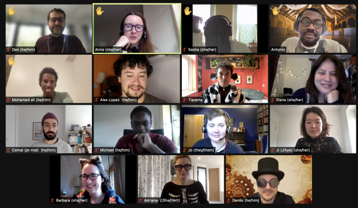

This blog is a follow up to
[My Journey to Becoming a Developer. ](https://www.annacunnane.co.uk/blog/My%20journey%20to%20become%20a%20developer) 

In that post I described how I’d come to apply to the Founders and Coders bootcamp and make the switch to a new career. 

Now as I start my first job in the tech industry I’m reflecting on my experiences on the course and my hopes for the future.

 

Some of the FAC22 members (and mentors) dressed for Halloween 👻

### What did I learn in the past 12 weeks at FAC?

Most obviously I learnt a lot about web development. The FAC curriculum teaches HTML, CSS, JavaScript, Node.js, SQL, Next.js and React. I learnt how to build a web application from scratch which culminated in our final [Tech for Better](https://github.com/tech-for-better/solent-mind) projects with real life stakeholders. 

Beyond the technical skills I feel like I got a crash course in learning to work as a team. The way the FAC course is structured means that you are constantly learning from and teaching each other - alongside guidance from mentors from previous cohorts. There is an emphasis at FAC on leaving nobody behind which makes it a very supportive environment in which to learn. 

I also improved my persistence and problem solving which I think are crucial skills for all developers. Learning how to learn - and Google things where you are unsure - is the only way to keep up with the ever changing technologies and frameworks in the industry.

### What were the challenges? 
As it was a bootcamp it was very intense and in the first half of the course we were learning a big new topic every week. I often felt like I was only grasping the fundamentals of the previous week by the middle of the next. I had, and still do have, a persistent feeling like I don’t know enough. I also struggled with the feeling of frustration that you get from tricky bugs (read [here](https://interestingengineering.com/the-origin-of-the-term-computer-bug) for why computer problems are called bugs 🦟).

### What’s next?
I've started an apprenticeship as a software developer at [Common Knowledge](https://commonknowledge.coop/) which I’m really excited about. I’ll also be back at FAC for a week in January to help mentor the next cohort. In the longer term I’d like to play an active role in the FAC community by helping out beginners as well as learning from my peers. 

If you are looking to change careers into software development I strongly recommend [Founders and Coders](https://www.foundersandcoders.com/apply/). If I can answer any questions about the process of applying for a software bootcamp please feel free to contact me using the form on my [about page](https://www.annacunnane.co.uk/about) or email hello@annacunnane.co.uk.
