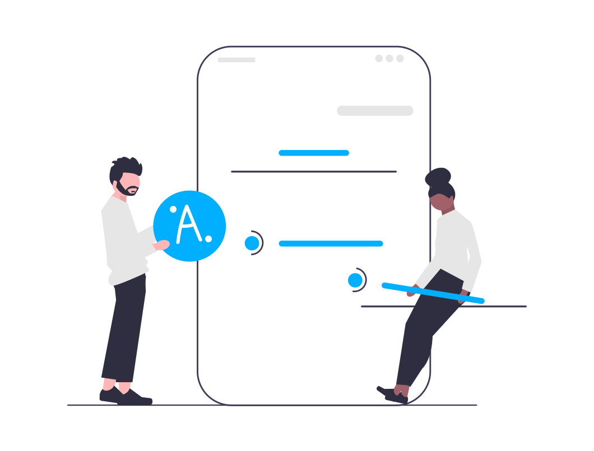

### What is a CMS?

A CMS or content management system is an application that helps users create, manage and modify content on a website.
Most CMS are designed to be easy to use without knowing how to code. They typically have design templates to choose from and offer extensions and add-ons. A good CMS platform will allow you to easily import and export your content.
Some commonly used CMS are WordPress, Django, Drupal, Wix and Joomla.

### Headless CMS vs Traditional CMS

A traditional CMS has two layers:
A presentation layer which determines how your content is displayed in the browser
A database where the content is structured and stored.

This type of tightly connected structure is called “coupled” and it makes structural changes almost impossible without knowing HTML and CSS. The presentation layer
A Headless CMS separates the presentation layer (known as the “Head”) from the database with communication between the two happening via an API (application programming interface).

### Headless API

Some traditional CMS platforms such as WordPress have developed their own API which allows users to apply a different language or framework on the frontend. This means that you get the best of this free and powerful CMS without being tied to its standard way of presenting content.
WordPress has also adopted the Gutenberg editor which is written in a popular frontend framework called React.

### Content infrastructure

Content infrastructure is a type of headless CMS but instead of arranging content around website pages it creates a content model. This model will break down the content into its component parts such as a newsletter sign-up, a headline or article copy. It will be collected into a centralized hub that can have different outputs such as a website, an app or internal collaboration and communication tools.

### Why use a Headless CMS?

There are many advantages to using a Headless CMS including flexibility, scalability and enhanced security as the presentation layer is not connected to the database. This approach can be seen as the best of both worlds: allowing you to make the most of mature platforms like WordPress and Django with flashier options on the frontend.
There are even further benefits to content infrastructure which reduces content duplication and makes collaboration easier.

Read Contentful's [Headless CMS explained in 1 minute](https://www.contentful.com/r/knowledgebase/what-is-headless-cms/)

Get a list of open source (free-to-use) CMS from [Geekflare](https://geekflare.com/open-source-headless-cms/)
