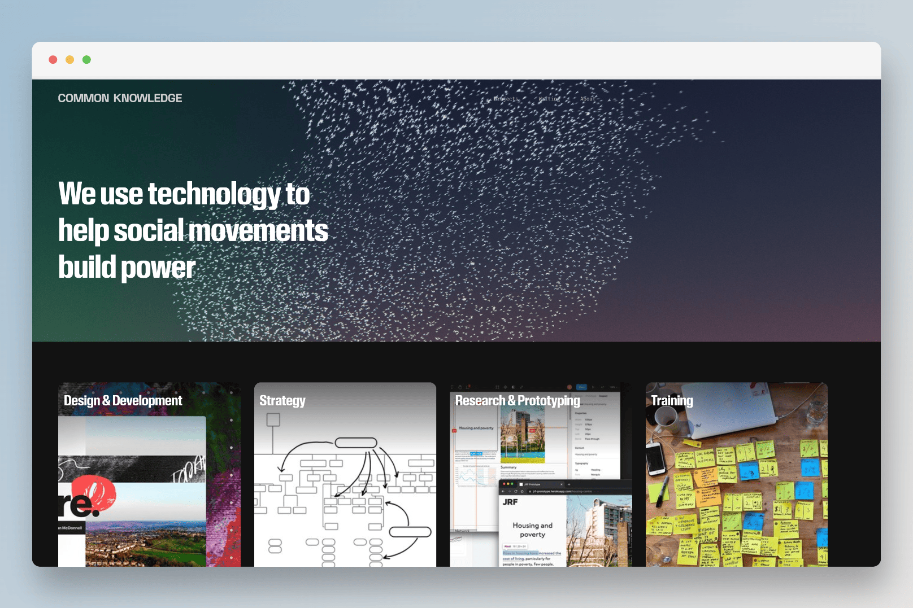

For the final part of my Software Development Apprenticeship I’ve been working on a new website for [Common Knowledge](https://commonknowledge.coop/). Common Knowledge makes digital tools to help social movements build power. They needed a new website that could be updated with a CMS and could better display the range of work that the co-op does.

 

## Website stack 🥞

### Wagtail CMS 🦜
I built the site with Wagtail which is an open-source content management system (CMS) built on the Django web framework. I chose Wagtail for this project because it has a user friendly admin interface that makes it easy to add and update content. It is also fully customisable and extensible with a range of packages and plugins available and an active developer community. Wagtail also inherits Django’s built in protection from common security vulnerabilities in web applications. 

### Tailwind CSS 💅
For CSS I used Tailwind which helped speed up the development process as it gave me access to thousands of in-built utility classes that I could add directly into my HTML. I set up a Tailwind configuration file where I declared values for colours, a type scale, fonts and breakpoints. This helped me to quickly apply a consistent design and visual style to the site. 

### Stimulus JS ⚡
I used StimulusJS which is a lightweight JavaScript framework to add small reusable snippets of JavaScript into the HTML templates I already had with Django. I avoided using a framework like React because it would add an unnecessary amount of files for what would be a relatively simple functionality.

## What went well ✅
These are some of the highlights from the project:
- Using Wagtail meant that I could get a site set up with a full content management system and user authentication within minutes 
- Wagtail also allowed me to create custom mixed content blocks (known as Streamfields) that can be reused across the site. 
- Using Tailwind minimised the risk of conflicting styles in my CSS and made it easier to debug in the DevTools Inspector. I also didn’t have to switch between HTML and CSS files while I was developing or think about how to name my CSS classes.
- With the Fly.io CLI I could create and launch an app on Fly.io from my terminal. This combined with a GitHub Action made deploying to the staging environment for the site really smooth.

## Biggest challenges 🚨
There were of course bugs and challenges throughout the project.
- One of the things I struggled with the most was working with Django migration files. These files contain the SQL that Django needs to create, update or delete database tables. I occasionally found that the files conflicted with one another or that they had become out of sync with the state of my local database. To debug this I learnt a lot about SQL and how Django keeps track of migrations. 
- I used the Stimulus JS package Turbo Drive to improve the speed of page transitions within the site but this also prevented the browser from loading any JavaScript that was not within a Stimulus controller without a full refresh. To fix this I recreated the JavaScript behaviour I wanted for the navbar from within a Stimulus controller ensuring it would work in conjunction with Turbo Drive.  

## Future improvements 🔮
Although my full time work on this project has come to an end there are some improvements I would like to make in the future. One of these is to theme the CMS admin interface with the Common Knowledge brand colours. I would also like to add an option for the visitor to select a colour scheme that provides a higher contrast than the default. Lastly there are definitely performance improvements I can make by replacing jpeg images with WebP formats and caching static content.
